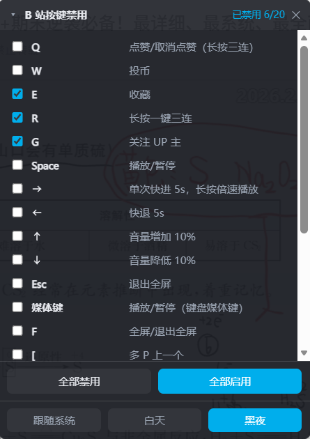
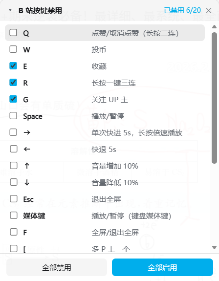

# 【哔哩哔哩】按键禁用 · Bilibili Key Blocker
[](https://github.com/cgy141514/bilibili-key-blocker/releases)
[](LICENSE)
[](https://github.com/cgy141514/bilibili-key-blocker)
[](https://raw.githubusercontent.com/cgy141514/bilibili-key-blocker/main/bilibili-key-blocker.user.js)

按需禁用 B 站播放页的**任意快捷键**。20 个按键逐项开关，设置面板可折叠、可拖动、能记忆位置，支持白天 / 黑夜 / 跟随系统三种主题。

B 站的「快捷键说明」里所有按键都可以被拦下。

---

## 界面预览

| 黑夜主题 | 白天主题 |
| :---: | :---: |
|  |  |

折叠后只保留一条标题栏，不挡视频：

```text
▾  B 站按键禁用        已禁用 3/20        ✕
```

## 目录

- [界面预览](#界面预览)
- [功能特性](#功能特性)
- [支持的按键](#支持的按键)
- [安装](#安装)
- [使用说明](#使用说明)
- [常见问题](#常见问题)
- [兼容性](#兼容性)
- [工作原理](#工作原理)
- [项目结构](#项目结构)
- [反馈与贡献](#反馈与贡献)
- [更新日志](#更新日志)
- [许可与致谢](#许可与致谢)

## 功能特性

- **任意按键可禁**：20 个快捷键逐项开关，列表顺序与 B 站「快捷键说明」面板完全一致。
- **一键批量**：面板底部「全部禁用 / 全部启用」，不用一个一个点。
- **可折叠设置面板**：点标题栏的 `▾ / ▸` 或标题文字即可折叠成一条细栏；`✕` 关闭后随时从脚本菜单唤回。
- **可拖动 + 记忆位置**：面板停在哪儿、是否折叠，下次打开还在原处。
- **滚动不穿透**：在面板上滚动不会带动 B 站页面；列表滚到顶 / 底后继续滚动也不会穿透。
- **三种主题**：跟随系统 / 白天 / 黑夜。选「跟随系统」时，系统切换深浅色会**实时**生效。
- **输入框安全**：在搜索框、弹幕框、评论区打字不会被拦截（唯一例外是 `Enter`，因为它就是「发弹幕」）。
- **菜单零打扰**：脚本菜单**只占 1 项**，不会撑爆脚本管理器的弹层。

## 支持的按键

| 按键 | B 站中的作用 |
| --- | --- |
| `Q` | 点赞/取消点赞（长按一键三连） |
| `W` | 投币 |
| `E` | 收藏 |
| `R` | 长按一键三连 |
| `G` | 关注 UP 主 |
| `Space` | 播放/暂停 |
| `→` | 单次快进 5s，长按倍速播放 |
| `←` | 快退 5s |
| `↑` | 音量增加 10% |
| `↓` | 音量降低 10% |
| `Esc` | 退出全屏 |
| 媒体键 `play/pause` | 播放/暂停（键盘上的媒体键） |
| `F` | 全屏/退出全屏 |
| `[` | 多 P 上一个 |
| `]` | 多 P 下一个 |
| `Enter` | 发弹幕 |
| `D` | 开启/关闭弹幕 |
| `M` | 开启/关闭静音 |
| `Shift + 1` | 一倍速（正常倍速） |
| `Shift + 2` | 二倍速 |

## 安装

1. 先安装任一脚本管理器：[Tampermonkey](https://www.tampermonkey.net/)、[Violentmonkey](https://violentmonkey.github.io/)、[ScriptCat](https://scriptcat.org/)（**更推荐ScriptCat，国内可直接访问**）。
2. 打开用户脚本管理器 → 新建脚本 → 清空模板 → 粘贴 [`bilibili-key-blocker.user.js`](bilibili-key-blocker.user.js) 的全部内容 → 保存（快捷键 `Ctrl + S`）→刷新B站视频页面。


## 使用说明

**打开面板**：点击脚本管理器的图标 → 菜单里的「**⚙️ 按键禁用设置面板（已禁用 n/20）**」。该菜单项同时也是开关 —— 再点一次收起面板。

**面板操作**：

| 位置 | 操作 |
| --- | --- |
| 标题栏 `▾ / ▸` 或标题文字 | 折叠 / 展开标题栏以下的区域 |
| 标题栏空白处拖动 | 移动面板，松手后记住位置 |
| 标题栏 `✕` | 关闭面板（用脚本菜单重新打开） |
| 每一行 | 勾选即禁用该按键 |
| 「全部禁用 / 全部启用」 | 一次切换全部 20 项 |
| 「跟随系统 / 白天 / 黑夜」 | 切换面板配色 |

所有状态（开关、主题、折叠、位置）都会保存，刷新或换视频后依旧生效。

> 面板右上角显示当前禁用数量，例如 `已禁用 3/20`；一个都没禁用时显示「未禁用」。

## 常见问题

**Q：勾选了某个键，但按下去 B 站还是有反应？**
1. 确认光标不在输入框 / 弹幕框 / 评论区里 —— 这些位置除了 `Enter` 之外一律不拦截，这是为了让你能正常打字；
2. 刷新页面让脚本重新注入。

**Q：勾选 `Space` 或方向键之后，页面不能滚动了 / 光标不能移动了？**
这是禁用生效的必然结果 —— 要拦住 B 站的处理，就必须同时 `preventDefault` 掉浏览器默认行为。不想要这个副作用就请勿勾选它们。

**Q：面板不见了？**
从脚本菜单再点一次「⚙️ 按键禁用设置面板」即可。如果是不小心拖到了屏幕外面，它仍会留出约 60px 可抓取区域，直接拖回来。

**Q：会上传我的数据吗？**
不会。脚本只用了 4 个 `GM_*` 接口做本地开关存储（见元数据 `@grant`），**没有任何网络请求**，也不读取页面内容，源码不到 600 行，可自行通读。

## 兼容性

| 环境 | 状态 |
| --- | --- |
| Tampermonkey | ✅ 已适配（含子版本更新） |
| Violentmonkey | ✅ |
| ScriptCat | ✅ |
| Chrome / Edge / 其他 Chromium 内核浏览器 | ✅ |
| Firefox | ✅（依赖标准的 `GM_*` 接口） |

需要浏览器支持 Shadow DOM、CSS 自定义属性与 `matchMedia`（所有现代浏览器均已支持）。

## 工作原理

1. 脚本以 `@run-at document-start` 注入，在 B 站页面脚本之前执行。
2. 在 **window 的捕获阶段** 监听 `keydown` / `keyup`。捕获阶段自上而下传播，因此监听器会先于页面（包括播放器）自身的任何监听器触发。
3. 命中已禁用的按键时依次执行：

   ```js
   e.preventDefault();               // 阻止浏览器默认行为（滚动、快进等）
   e.stopImmediatePropagation();     // 阻止同元素上的其他监听器
   e.stopPropagation();              // 阻止事件继续传播到页面
   ```

   页面完全收不到这个事件，长按类快捷键（`Q` 长按三连、`R` 一键三连、`→` 长按倍速）的抬起动作也会一起被拦住。

4. 两种情况直接放行：输入法组合输入中（`isComposing` / `keyCode === 229`），以及焦点位于输入类元素（`input` / `textarea` / `select` / `contenteditable`）——后者仅对标记了 `blockInInput` 的按键例外（即 `Enter`）。

## 项目结构

```
bilibili-key-blocker/
├── .github/
│   └── workflows/
│       └── release.yml            # 打 tag 自动发 Release 并附带脚本
├── docs/
│   ├── panel-dark.png             # 面板截图（黑夜）
│   └── panel-light.png            # 面板截图（白天）
├── bilibili-key-blocker.user.js   # 全部实现，单文件用户脚本
├── CHANGELOG.md
├── README.md
├── LICENSE
└── .gitignore
```

没有构建步骤：`bilibili-key-blocker.user.js` 就是最终产物，改完直接提交。

## 更新日志

完整记录见 [CHANGELOG.md](CHANGELOG.md)。

### v0.1.1 — 2026-10-07

- 修复：面板内滚动到顶部 / 底部后继续滚动会穿透并带动 B 站页面，现在标题栏、按钮区滚动同样不会带动页面

### v0.1.0 — 2026-10-07

首次发布。

- 支持 20 个快捷键的逐项禁用，顺序与 B 站「快捷键说明」一致
- 页面内可折叠、可拖动、记忆位置的设置面板
- 全部禁用 / 全部启用
- 白天 / 黑夜 / 跟随系统主题
- 输入框内自动放行，`Enter` 例外（用于禁用发弹幕）

## 反馈与贡献

- 遇到问题、想新增可禁用的按键：[提交 Issue](https://github.com/cgy141514/bilibili-key-blocker/issues)
- 欢迎 Pull Request。改动脚本请同步提升 `@version`，并在 [CHANGELOG.md](CHANGELOG.md) 里补一条记录 —— 打 tag 时 [release.yml](.github/workflows/release.yml) 会校验两者是否一致，不一致会直接失败。
- 提 Issue 时附上：B 站页面链接、浏览器版本、脚本管理器及版本，以及 F12 控制台里带 `bilibili-key-blocker` 前缀的日志，会更容易定位问题。

> 本脚本已在 Chrome + Tampermonkey / ScriptCat 下测试，无法保证覆盖所有页面场景；发现异常欢迎反馈。

## 许可与致谢

本项目基于 [MIT 许可证](LICENSE) 开源，© 2026 cgy141514。
